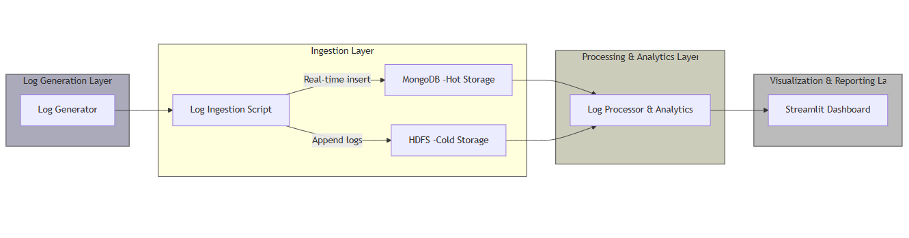

# Real-Time Log Analysis Platform

## **Project Overview**

This project is a **Real-Time Log Analysis Platform** designed to simulate enterprise-grade log monitoring and analytics. It is optimized for **Windows environments with low-spec machines**, using lightweight technologies while maintaining **core big data concepts**.  

The system generates synthetic application logs, ingests them into **MongoDB** and **HDFS**, processes the logs for analytics, and visualizes them in a **real-time dashboard**.  

---

## **Key Features**

- Continuous log generation simulating multiple services and error levels.  
- Real-time log ingestion into **MongoDB** (hot storage) and **HDFS** (cold storage).  
- Log processing using **Python + Pandas** for analytics.  
- Real-time visualization via **Streamlit dashboard**.  
- Generates JSON-based analytical reports.  
- Supports multi-service, multi-level log analysis including response times, error detection, and service activity.  

---

## **Architecture**

## **Installation & Setup**
1. Clone Repository
git clone <repository_url>
cd RealTimeLogAnalysis

2. MongoDB Setup

Install MongoDB Community Edition on Windows.

Start MongoDB service:

net start MongoDB

Ensure database directory exists (C:\data\db).

3. HDFS Setup

Install Hadoop (Windows) or use HDFS client.

Format the NameNode and start HDFS:

cd C:\hadoop\hadoop-3.4.2\sbin
hdfs namenode -format
start-dfs.cmd

Verify HDFS log file:

hdfs dfs -tail /logs/application.log

4. Running the Project (Multiple Command Prompts)

To run the system, open 4 separate CMD windows:

CMD Window 1 – Log Generator

cd C:\RealTimeLogAnalysis
venv\Scripts\activate
cd scripts
python log_generator.py

CMD Window 2 – Log Ingestion

cd C:\RealTimeLogAnalysis
venv\Scripts\activate
cd scripts
python log_ingestion.py

CMD Window 3 – Dashboard

cd C:\RealTimeLogAnalysis
venv\Scripts\activate
cd dashboard
streamlit run streamlit_dashboard.py

CMD Window 4 – Analytics & Report Generation

cd C:\RealTimeLogAnalysis
venv\Scripts\activate
cd scripts
python log_processor.py

CMD Window 5 – Upload logs to HDFS

cd C:\RealTimeLogAnalysis
venv\Scripts\activate
cd scripts
python upload_logs_to_hdfs.py